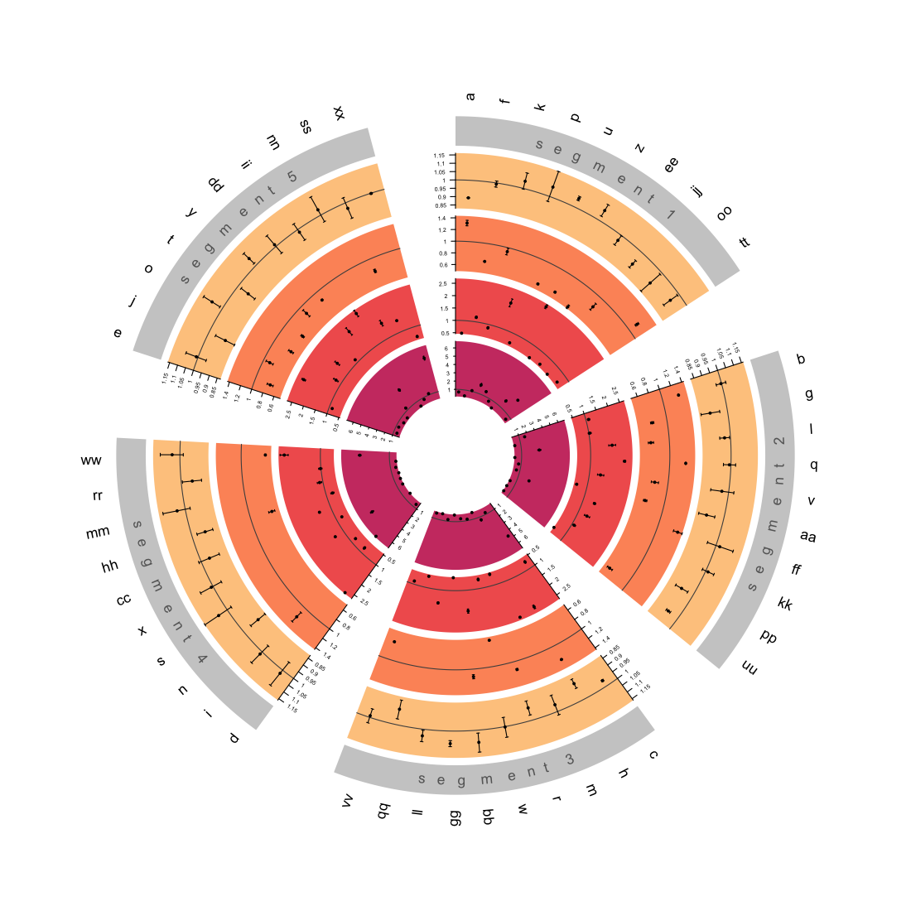

```{r, echo = FALSE}
knitr::opts_chunk$set(
  collapse = TRUE,
  comment = "#>",
  echo = F)

```

# circos.triangulate </a>

`circos.triangulate` is build from the [`Circlize`](https://github.com/jokergoo/circlize) package to allow for easy visualisation of large numbers of protein analyses, with triangulated data in mind, allowing each different source to be displayed as a different track. Automatic resizing occurs to ensure tracks are displayed clearly, with custom options such as generating odds ratios where a beta and standard error column are given, chosing which set of data is displayed as the primary (1st) track and dealing with missing data.

To ensure the expected outcome data should be formatted in a `data.frame` as in the example below.

```{r message=FALSE, warning=FALSE}
library(tidyverse)
n_values <- 50
letters52 <- c(letters,paste0(letters, letters))
proteins <- letters52[1:50]

sample_reverse_mr <- data.frame(protein = proteins,
                                disease = rep("cancer", n_values),
                                method = rep("Reverse MR (IVW)", n_values),
                                b = runif(n=n_values, min=-0.121555, max=0.07898039),
                                se = runif(n=n_values, min=-0.001254849, max=0.04765049),
                                track_id = 1)

sample_forward_mr <- data.frame(protein = proteins,
                                disease = rep("cancer", n_values),
                                method = rep("Forward MR (IVW)", n_values),
                                b = runif(n=n_values, min=-0.6876041, max=0.3437124),
                                se = runif(n=n_values, min=-0.001254849, max=0.04765049),
                                track_id = 2)

sample_obvs <- data.frame(protein = proteins,
                          disease = rep("cancer", n_values),
                          method = rep("Direct Measures", n_values),
                          b = runif(n=n_values, min=-1, max=1),
                          se = runif(n=n_values, min=-0.001254849, max=0.04765049),
                          track_id = 3)

sample_other <- data.frame(protein = proteins,
                          disease = rep("cancer", n_values),
                          method = rep("Other Analysis", n_values),
                          b = runif(n=n_values, min=-2, max=2),
                          se = runif(n=n_values, min=-0.001254849, max=0.04765049),
                          track_id = 4)


segment_data <- data.frame(protein = proteins, segment = rep(c("segment 1", "segment 2", "segment 3", "segment 4", "segment 5"), length(proteins)/5))

sample_data <- rbind(sample_obvs, sample_reverse_mr, sample_forward_mr[as.integer(runif(n=50, min=1, max=n_values)) %>% unique(),], sample_other)
sample_data <- sample_data %>% inner_join(segment_data)

sample_data %>% filter(protein == "a" | protein == "b")

```

To generate a `circos.triangulate` plot follow the example below:

```{r eval=F, include=T, echo=T}
# install.packages("remotes")
remotes::install_github("lisamhobson/circos.triangulate")

circos_protein_plot(circos_data = sample_data, # data.table containing all of the data to plot
                    total_track_number = 4, # total number of tracks to plot (can be less than sources of data if only plotting subset)
                    track_id_column = "track_id", # name of column containing variable to determine which track e.g. method / data source
                    protein_column = "protein", # column containing names of proteins
                    beta_column = "b", # column containing beta value 
                    se_column = "se", # column containing standard error to generate error bars
                    primary_track = "1", # variable from "track_id_column" to determine which track is first to plot and used to generate names
                    segment_names_column = "segment", # column containing factor to subset data on
                    # optional
                    odds_ratios = TRUE, # boolean value, whether to generate and plot odds ratios from beta and se (default = FALSE)
                    error_bar_ends = TRUE, # boolean value, whether to add ends to error bars (default = T)
                    custom_pallet = c("#FEC98DFF", "#FD9567FF", "#F1605DFF", "#CD4071FF") # provide custom colour pallet, supports viridis or custom vector
                    )
```

# 

## Future Updates

-   Colour coded key for data sources

-   Zoomed segment plot