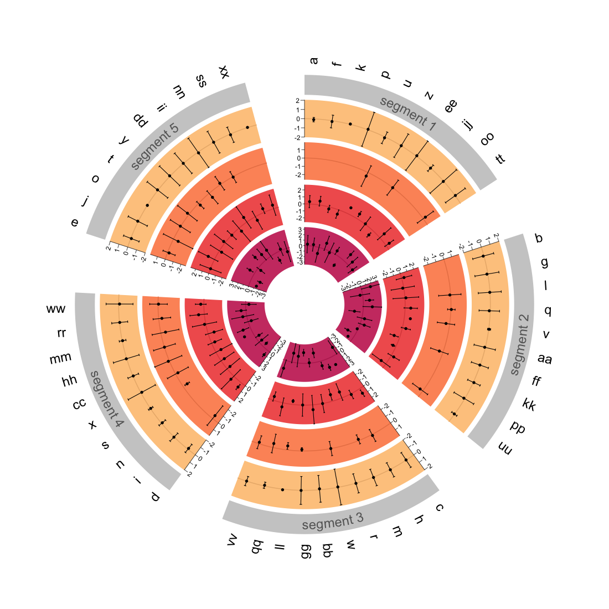
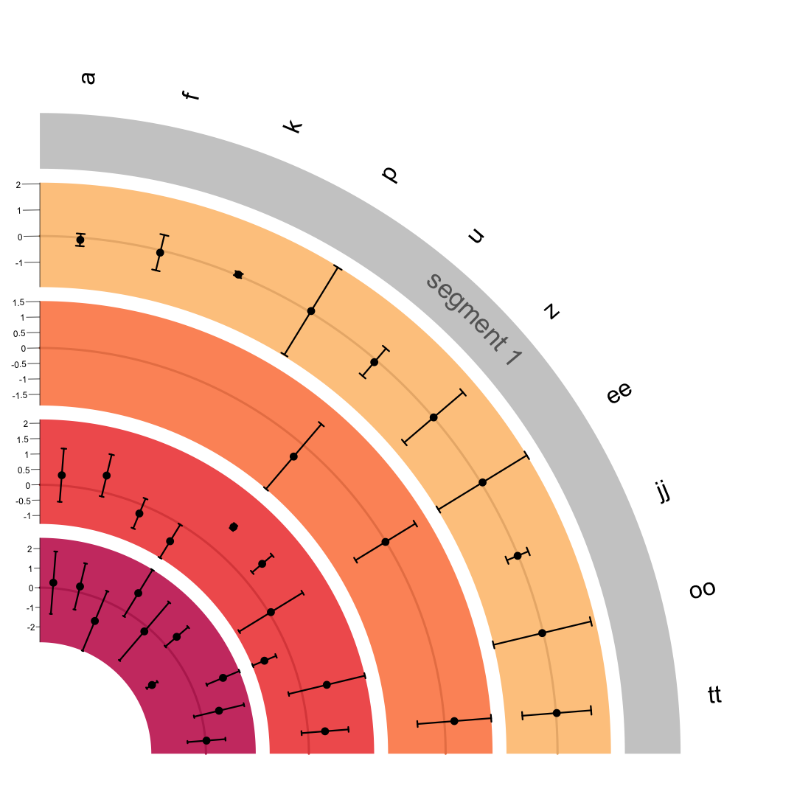
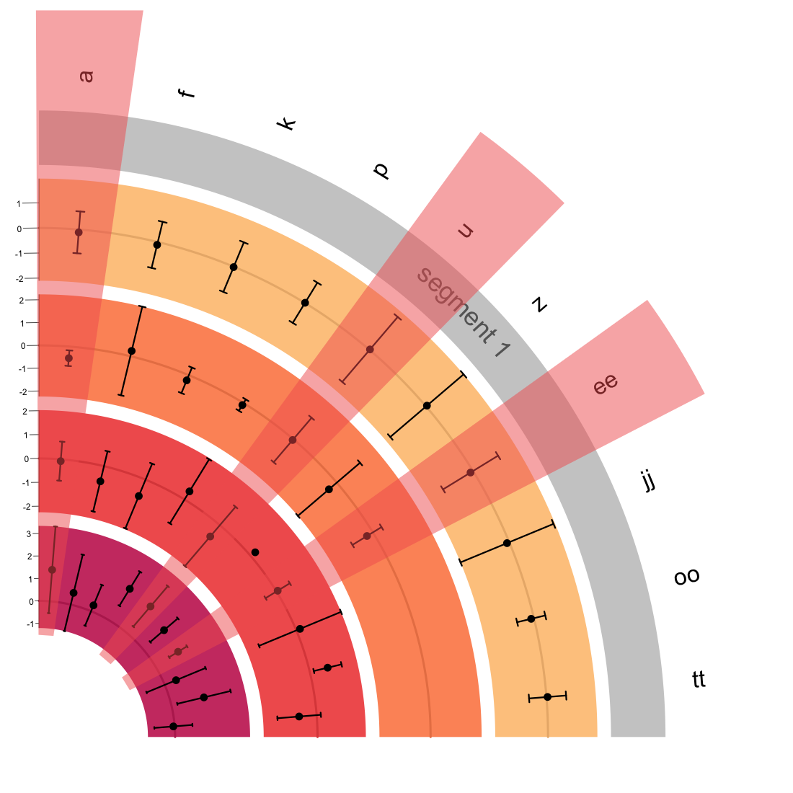

# circos.triangulate </a>

`circos.triangulate` is build from the
[`Circlize`](https://github.com/jokergoo/circlize) package to allow for
easy visualisation of large numbers of protein analyses, with
triangulated data in mind, allowing each different source to be
displayed as a different track. Automatic resizing occurs to ensure
tracks are displayed clearly, with custom options such as generating
odds ratios where a beta and standard error column are given, choosing
which set of data is displayed as the primary (1st) track and dealing
with missing data. Custom colour palettes now support dark colours,
light points and error bars will automatically be applied when the track
colour is dark.

To ensure the expected outcome data should be formatted in a
`data.frame` as in the example below.

    #>   protein disease           method           b         se track_id   segment
    #> 1       a  cancer  Direct Measures -0.47112647 0.31271615        3 segment 1
    #> 2       b  cancer  Direct Measures -0.29714968 0.82816935        3 segment 2
    #> 3       a  cancer Reverse MR (IVW) -0.06311827 0.96892441        1 segment 1
    #> 4       b  cancer Reverse MR (IVW) -0.00256487 0.23452589        1 segment 2
    #> 5       b  cancer Forward MR (IVW)  0.15448639 0.07937798        2 segment 2
    #> 6       a  cancer   Other Analysis  1.37469200 0.67877119        4 segment 1
    #> 7       b  cancer   Other Analysis -0.43389588 0.35856626        4 segment 2

To generate a `circos.triangulate` plot follow the example below:

``` r
# install.packages("remotes")
remotes::install_github("lisamhobson/circos.triangulate", force=T)
library(circos.triangulate)

circos_protein_plot(circos_data = sample_data, # data.table containing all of the data to plot
                    total_track_number = 4, # total number of tracks to plot (can be less than sources of data if only plotting subset)
                    track_id_column = "track_id", # name of column containing variable to determine which track e.g. method / data source
                    protein_column = "protein", # column containing names of proteins
                    beta_column = "b", # column containing beta value 
                    se_column = "se", # column containing standard error to generate error bars
                    primary_track = "1", # variable from "track_id_column" to determine which track is first to plot and used to generate names
                    segment_names_column = "segment", # column containing factor to subset data on
                    # optional
                    odds_ratios = FALSE, # boolean value, whether to generate and plot odds ratios from beta and se (default = FALSE)
                    error_bar_ends = TRUE, # boolean value, whether to add ends to error bars (default = T)
                    custom_palette = c("#FEC98DFF", "#FD9567FF", "#F1605DFF", "#CD4071FF"), # provide custom colour palette, supports viridis or custom vector
                    axis_label_size = 1, # numerical value for axis label font size
                    text_size = 2, # numerical value for protein name text size
                    point_size = 1, # numerical value for point size
                    highlights = TRUE, # boolean value, whether to highlight specific proteins across tracks 
                    highlight_prots = c("a", "u", "ee"), # names of proteins to highlight, must be in protein_column
                    highlight_colour = "#F1605DFF" # colour to use for highlights, opacity is added automatically 
                    )
```

# 

## Segment circos plot

``` r
# zoom in on one segment 
circos_protein_plot_segment(circos_data = sample_data, # data.table containing all of the data to plot
                    total_track_number = 4, # total number of tracks to plot (can be less than sources of data if only plotting subset)
                    track_id_column = "track_id", # name of column containing variable to determine which track e.g. method / data source
                    protein_column = "protein", # column containing names of proteins
                    beta_column = "b", # column containing beta value 
                    se_column = "se", # column containing standard error to generate error bars
                    primary_track = "1", # variable from "track_id_column" to determine which track is first to plot and used to generate names
                    segment_names_column = "segment", # column containing factor to subset data on
                    segment_to_display = "segment 1", # segment to zoom in on
                    # optional
                    odds_ratios = FALSE, # boolean value, whether to generate and plot odds ratios from beta and se (default = FALSE)
                    error_bar_ends = TRUE, # boolean value, whether to add ends to error bars (default = T)
                    custom_palette = c("#FEC98DFF", "#FD9567FF", "#F1605DFF", "#CD4071FF"), # provide custom colour palette, supports viridis or custom vector
                    axis_label_size = 1, # numerical value for axis label font size
                    text_size = 3, # numerical value for protein name text size
                    point_size = 2, # numerical value for point size
                    )
```

# 

### With highlights

``` r
# add highlights to selected proteins
circos_protein_plot_segment(circos_data = sample_data, # data.table containing all of the data to plot
                    total_track_number = 4, # total number of tracks to plot (can be less than sources of data if only plotting subset)
                    track_id_column = "track_id", # name of column containing variable to determine which track e.g. method / data source
                    protein_column = "protein", # column containing names of proteins
                    beta_column = "b", # column containing beta value 
                    se_column = "se", # column containing standard error to generate error bars
                    primary_track = "1", # variable from "track_id_column" to determine which track is first to plot and used to generate names
                    segment_names_column = "segment", # column containing factor to subset data on
                    segment_to_display = "segment 1", # segment to zoom in on
                    # optional
                    odds_ratios = FALSE, # boolean value, whether to generate and plot odds ratios from beta and se (default = FALSE)
                    error_bar_ends = TRUE, # boolean value, whether to add ends to error bars (default = T)
                    custom_palette = c("#FEC98DFF", "#FD9567FF", "#F1605DFF", "#CD4071FF"), # provide custom colour palette, supports viridis or custom vector
                    axis_label_size = 1, # numerical value for axis label font size
                    text_size = 3, # numerical value for protein name text size
                    point_size = 2, # numerical value for point size
                    highlights = TRUE, # boolean value, whether to highlight specific proteins across tracks 
                    highlight_prots = c("a", "u", "ee"), # names of proteins to highlight, must be in protein_column
                    highlight_colour = "#F1605DFF" # colour to use for highlights, opacity is added automatically 
                    )
```

# 

## Future Updates

- Colour coded key for data sources

- ~~Highlight selected proteins across all tracks~~ ☑️

- ~~Zoomed segment plot~~ ☑️

- ~~Custom text and point size~~ ☑️
